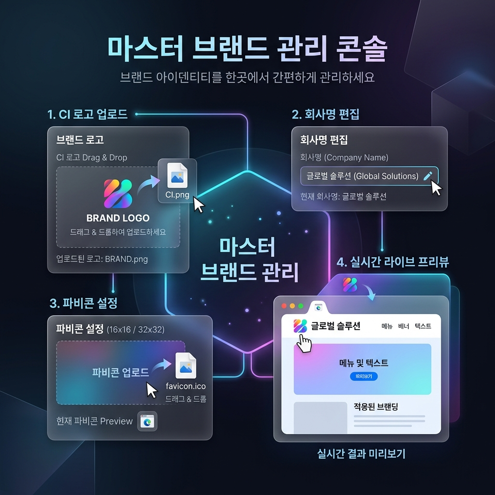
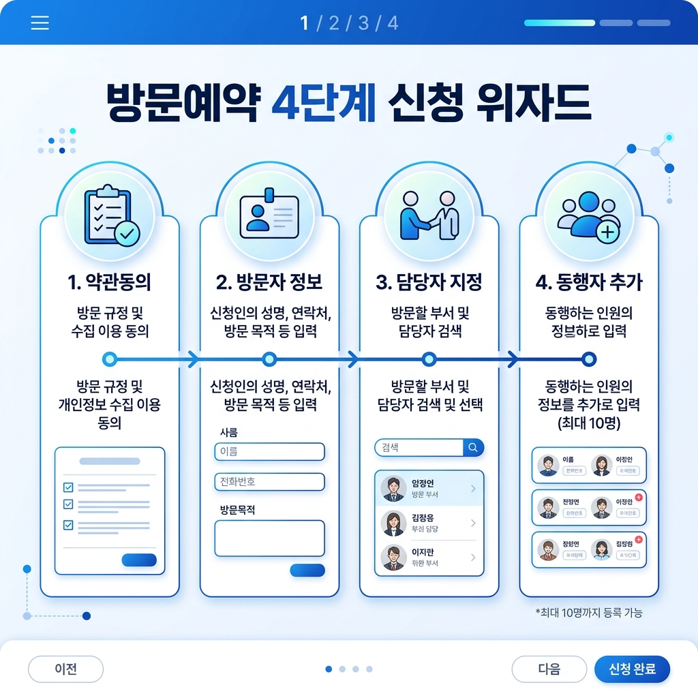
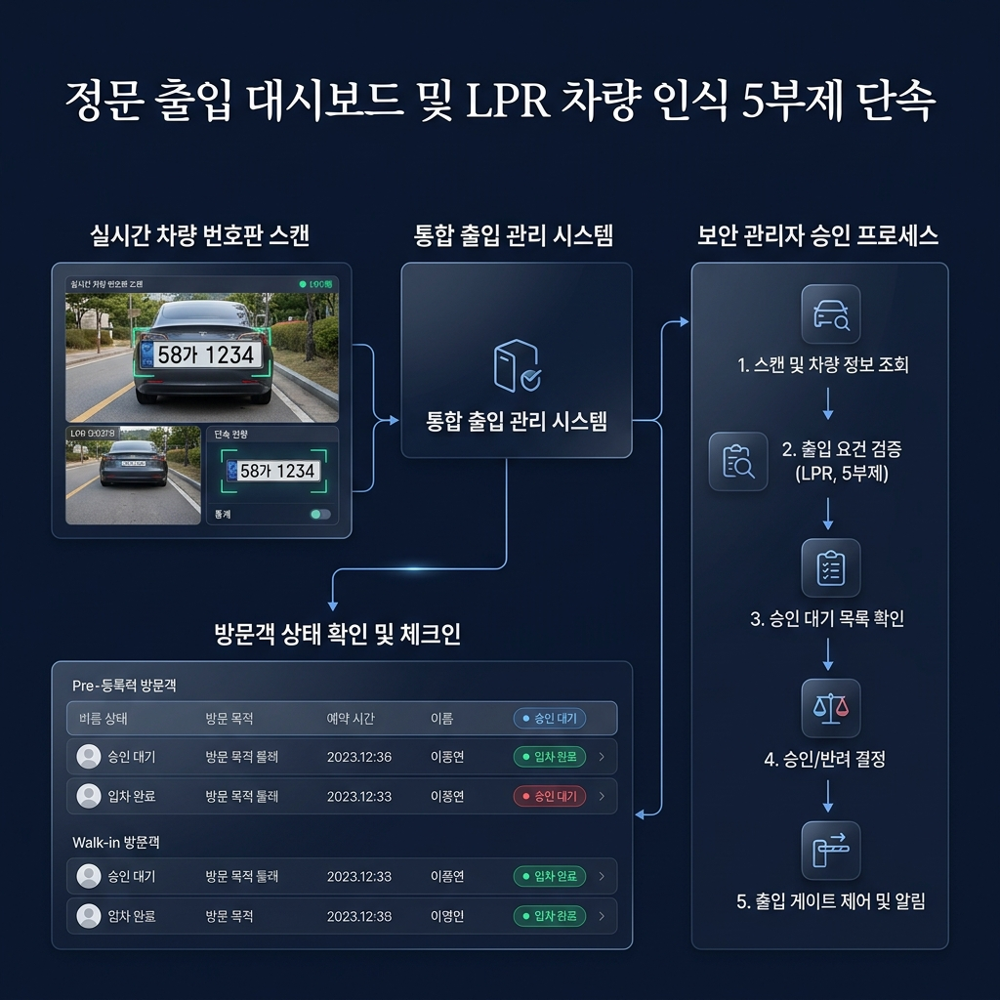
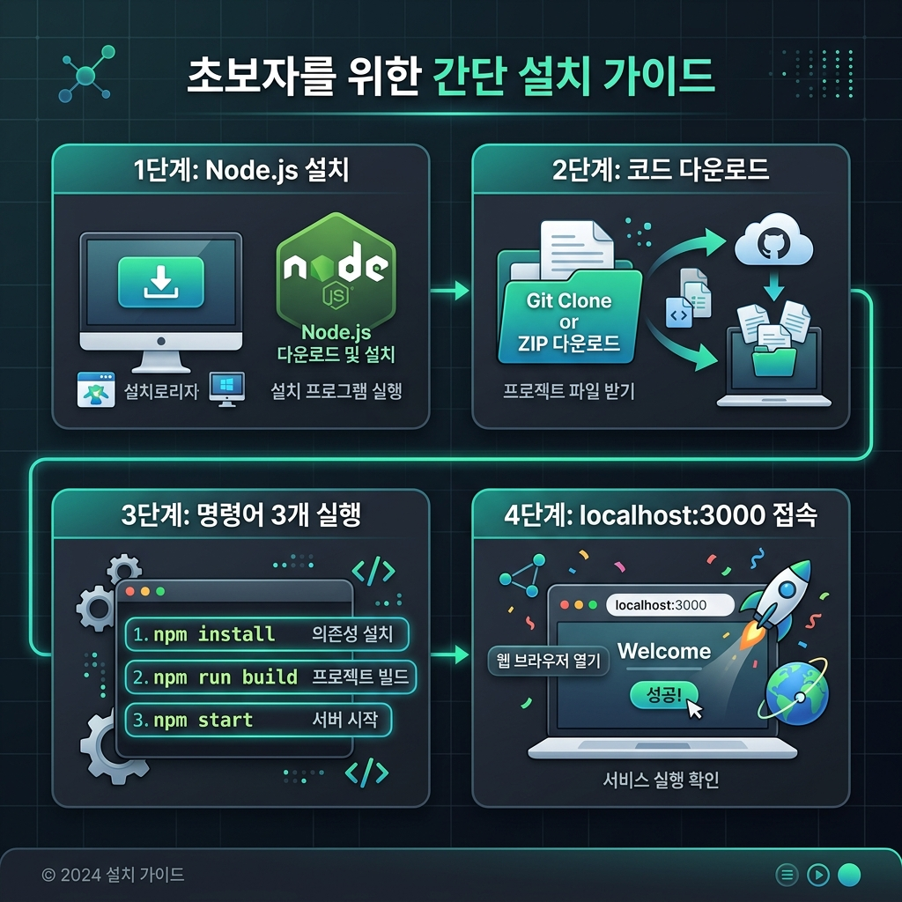
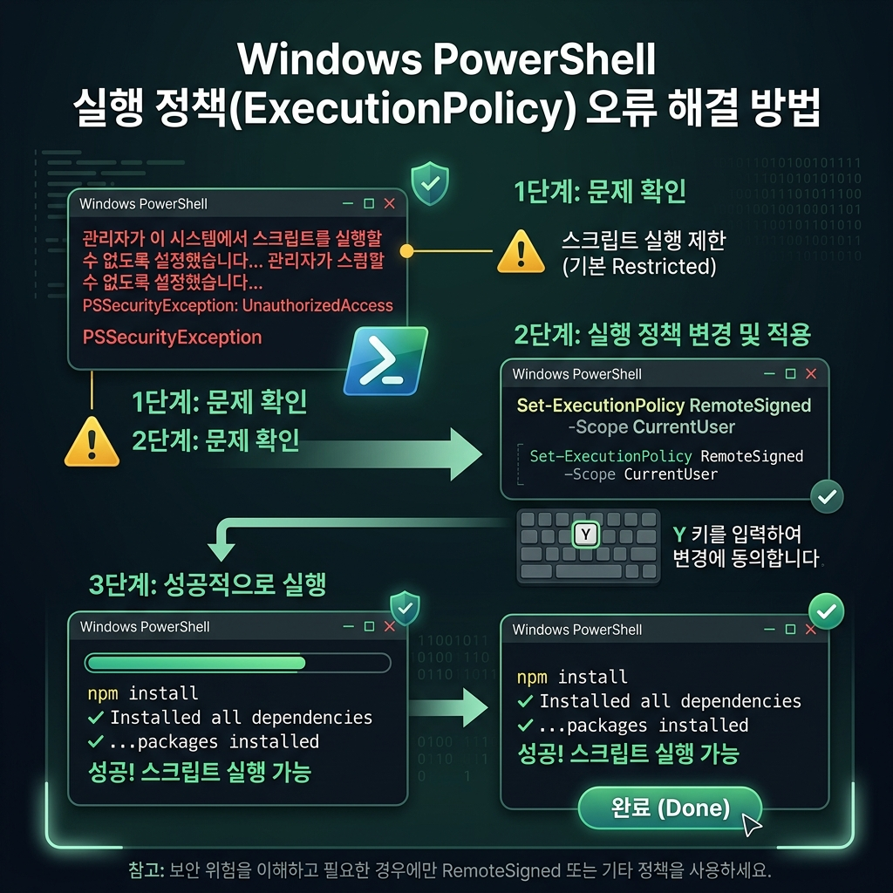
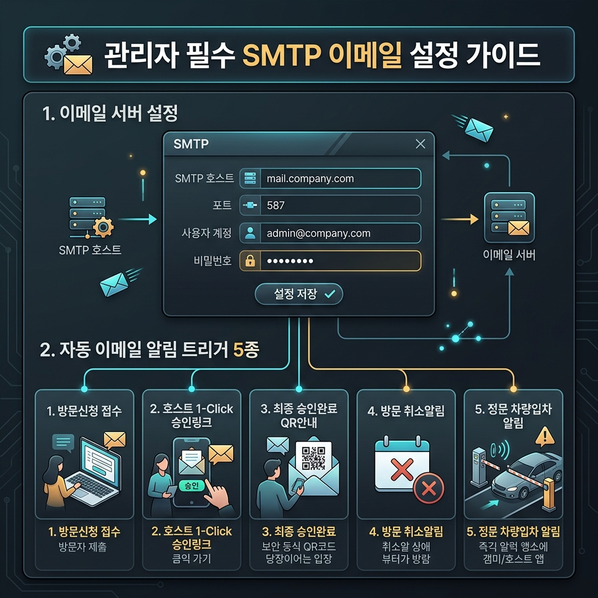
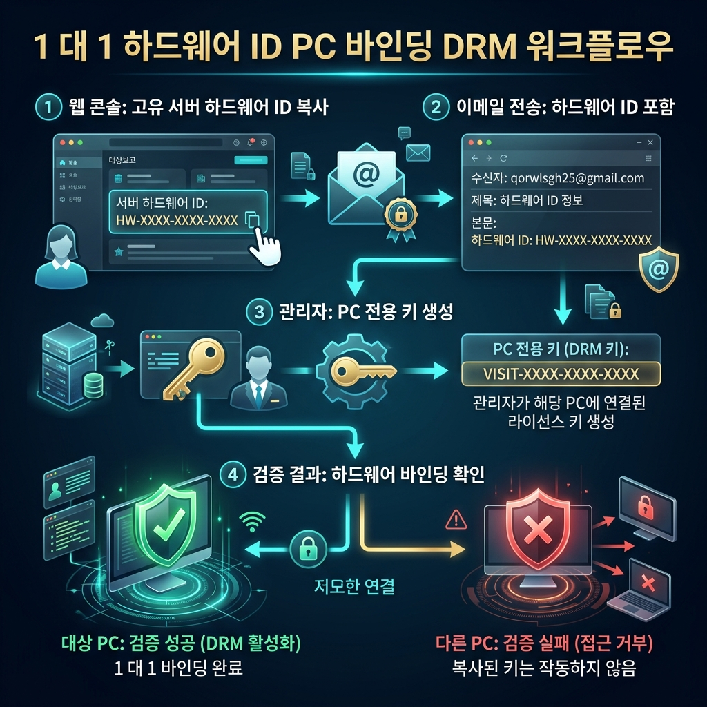

# 🎈 Visit (방문자 사전 예약 & 출입 보안 서비스)

> **👋 안녕하세요! 바이브코딩(Vibe Coding)을 처음 접하시는 분도 환영합니다!**  
> 이 프로젝트는 기업, 연구소, 학교, 공공기관 등 누구나 무료로 다운로드하여 내 회사나 조직의 맞춤형 **방문자 예약 웹 사이트**를 5분 만에 만들 수 있는 범용 소프트웨어입니다.

---

## 📸 한눈에 보는 핵심 기능 (Visual Features)

### 1. 🎨 내 마음대로 꾸미는 로고 & 회사명 (브랜딩 콘솔)
최고 관리자 페이지(`http://localhost:3000/admin/brand`)에서 회사명, CI 로고 이미지, 파비콘 아이콘을 직접 올리면 메인 화면과 메일에 실시간으로 반영됩니다.



---

### 2. 📝 쉽고 빠르고 스마트한 4단계 방문 신청
방문객은 복잡한 가입 없이 **약관 동의 ➡️ 방문 정보 입력 ➡️ 담당자 지정 ➡️ 동행자 추가(최대 10명)** 과정을 거쳐 신속하게 예약을 신청합니다.



---

### 3. 🛡️ 정문 출입 대시보드 & LPR 차량 자동 인식
경비실 대시보드에서 QR코드 입실 처리, 신분증/보관 카드 관리 및 정문 LPR 카메라인식으로 방문 차량과 임직원 5부제 위반 차량을 실시간으로 감지합니다.



---

## 🐣 5분 만에 끝나는 초간단 설치 따라하기

컴퓨터를 잘 몰라도 괜찮습니다! 아래 한글 가이드 그림과 순서대로 똑같이 눌러주시면 내 컴퓨터에서 바로 서비스가 켜집니다.



---

### ⚙️ 순서대로 똑같이 따라하기

#### 1단계: 필수 프로그램 (Node.js) 설치하기
1. 인터넷 창을 열고 **[https://nodejs.org](https://nodejs.org)** 사이트에 들어갑니다.
2. 화면 가운데에 있는 **`20.x.x LTS` (추천 버전)** 녹색 버튼을 눌러 다운로드합니다.
3. 다운받은 파일(`setup.exe`)을 실행한 뒤 **`Next`** 만 계속 클릭해서 설치를 완료합니다.

#### 2단계: 코드 다운로드받기
1. 이 페이지 맨 위 오른쪽의 녹색 **`<> Code`** 버튼을 누릅니다.
2. 맨 아래 **`Download ZIP`** 을 클릭하여 컴퓨터에 압축을 풀어줍니다.

#### 3단계: 명령어 복사해서 실행하기 (자동 환경 생성)
프로젝트 폴더 안에서 검은색 창(터미널 또는 PowerShell)을 열고, 아래 3개 명령어를 **한 줄씩 복사해서 엔터**를 쳐주세요:

> 💡 **⚠️ [중요] 윈도우 PowerShell 보안 권한 오류 발생 시 (`PSSecurityException / UnauthorizedAccess`)**:  
> 윈도우 기본 보안 정책 때문에 스크립트 실행이 차단되는 경우입니다. 아래 **해결 명령어 1줄**을 먼저 복사해서 실행(입력 후 `Y` 엔터)해 주시면 바로 해결됩니다!
> ```powershell
> Set-ExecutionPolicy RemoteSigned -Scope CurrentUser
> ```
> 

```bash
# 1. 필요 패키지 설치 및 기본 환경 설정(.env) 자동 생성
npm install

# 2. 데이터베이스(SQLite) 자동 생성
npx prisma db push

# 3. 데이터베이스 클라이언트 생성
npx prisma generate
```

#### 4단계: 내 사이트 켜기! 🚀
마지막으로 아래 명령어를 치고 엔터를 누르면 서버가 실행됩니다:

```bash
npm run dev
```

✨ 이제 웹 브라우저 주소창에 **`http://localhost:3000`** 을 치고 들어가면 멋진 방문 예약 사이트가 나타납니다!

---

## 📌 주요 접속 주소 (URL) 안내

외부 고의 URL 접근에 의한 민감 데이터 유출을 방지하기 위해 **모든 관리자 콘솔은 1회성 이메일 이중 인증(Magic Link) 게이트웨이로 보호**되고 있습니다.

| 어떤 기능을 사용하고 싶으신가요? | 주소창에 입력할 URL | 설명 |
| :--- | :--- | :--- |
| **🏠 방문객 메인 신청 화면** | `http://localhost:3000` | 누구나 방문 신청 및 예약 결과를 조회하는 페이지 |
| **🔒 관리자 통합 보안 로그인** | `http://localhost:3000/admin/smtp` | 이메일 1-Click 인증으로 관리자 세션을 여는 입구 |
| **🎨 로고 & 회사명 관리 (보안)** | `http://localhost:3000/admin/brand` | 이중 보안 인증 후 접속 가능한 브랜딩 콘솔 |
| **🛡️ 정문 경비실 출입 제어 (보안)** | `http://localhost:3000/admin/dashboard` | 보안협력사 이메일 인증 후 진입 가능한 대시보드 |

---

## 🔒 관리자 민감 정보 보호: 이중 보안 인증 게이트웨이

관리자 페이지에 주소를 직접 입력하여 무단 접근하는 행위를 차단하기 위해 **이메일 기반 1-Click 이중 인증 레이어**가 강제 적용되어 있습니다.


### 🛡️ 보안 인가 처리 원리
1. 외부 사용자가 `http://localhost:3000/admin/brand` 또는 `/admin/smtp` URL을 직접 입력하고 진입하면 **민감 정보가 모두 숨겨지고 보안 인증 요청 화면이 표시**됩니다.
2. 최고 관리자로 등록된 이메일을 입력하면 **1회성 매직링크(Security Token)**가 이메일로 전송됩니다.
3. 수신된 이메일에서 **1-Click 보안 링크**를 누른 관리자만 민감 정보를 조회하고 수정할 수 있습니다.

## 📧 관리자 필수 기초 설정: 이메일(SMTP) 가이드

`Visit` 서비스의 승인 절차 및 알림 기능은 **이메일(SMTP)**을 기반으로 자동으로 동작합니다. 따라서 사이트 설치 후 **최초 1회 SMTP 설정(`http://localhost:3000/admin/smtp`)**이 반드시 필요합니다.



---

### 💡 이메일 알림 설정이 반드시 필요한 이유
1. **비밀번호 없는 1-Click 인증**: 담당 임직원이나 경비실 직원이 복잡한 비밀번호 입력 없이 메일로 수신된 **보안 1회성 매직링크**를 클릭하여 대시보드에 즉시 안전 로그인합니다.
2. **실시간 업무 알림**: 방문자가 예약 신청을 하거나 차량이 정문에 들어왔을 때 담당 임직원이 즉시 알림을 받을 수 있습니다.

---

### 🔔 자동 이메일 알림이 발송되는 5가지 핵심 시점 (Event Triggers)

| # | 알림 이벤트 (발생 시점) | 메일 수신 대상 | 발송 내용 및 목적 |
| :---: | :--- | :--- | :--- |
| **1** | **방문 신청 접수 시** | 방문 신청자 (방문객) | 방문 접수 번호(6자리) 및 신청 접수 내역 확인 안내 |
| **2** | **담당자 승인 요청 시** | 접견 담당 임직원 (Host) | 방문 신청 알림 및 **1-Click 승인/반려 대시보드 접근 보안 링크** 전송 |
| **3** | **최종 승인 완료 시** | 방문 신청자 및 동행자 전체 | 정문 통과용 **QR 코드** 및 약관 서명 완료 최종 승인서 안내 |
| **4** | **방문 예약 취소 시** | 방문객 및 담당 임직원 | 방문 예약 취소 사실 및 사유 알림 통보 |
| **5** | **방문 차량 정문 입차 시** | 접견 담당 임직원 | LPR 카메라인식으로 사전 등록된 방문객 차량 정문 통과 시 즉시 알림 |

---

### ⚙️ SMTP 간단 설정 방법 (`http://localhost:3000/admin/smtp`)
1. 웹 브라우저에서 `http://localhost:3000/admin/smtp` 로 접속합니다.
2. 회사나 개인의 이메일 발송 서버 정보(예: 네이버, 구글, DaouOffice, 자체 사내 SMTP 메일 서버)를 입력합니다:
   - **SMTP Host**: 예) `smtp.naver.com` / `smtp.gmail.com`
   - **Port**: `465` (SSL) 또는 `587` (TLS) / `25`
   - **계정 및 비밀번호**: 메일 발송용 아이디/비밀번호 입력
3. **`설정 저장 및 테스트 메일 발송`** 버튼을 눌러 테스트 메일이 정상 도착하면 설정 완료입니다!

---

## 🏢 다운로드 사용자를 위한 회사명 및 브랜딩 변경 안내

사용자분의 환경이나 회사에 맞게 **회사명과 로고/파비콘을 변경하는 방법은 2가지**가 있습니다.

### 방법 1: 웹 화면에서 클릭 몇 번으로 변경하기 (권장 - 1초 완성)
1. 웹 브라우저에서 **`http://localhost:3000/admin/brand`** 로 접속합니다.
2. **회사명** 란에 내 기업명(예: `OO기술주식회사`)을 입력합니다.
3. 내 회사의 **CI 로고 이미지**와 **파비콘 아이콘**을 업로드하고 **`브랜드 설정 저장하기`**를 누르면 메인 화면과 메일에 실시간 반영됩니다.

### 방법 2: 약관 문서 파일 직접 편집하기 (필요시)
방문 서약서 및 약관 문서 파일들은 프로젝트 폴더 내 `info/` 디렉토리에 마크다운(`.md`) 파일로 관리되고 있습니다. 세부 법적 약관 내용을 내 회사에 맞게 수정하고 싶다면 아래 파일들을 메모장이나 VS Code로 열어 편집하실 수 있습니다:
- 1. **방문신청 약관**: `info/방문신청약관.md`
- 2. **개인정보처리방침**: `info/개인정보처리방침.md`
- 3. **안전수칙 준수 서약서**: `info/안전수칙준수방침.md`
- 4. **방문객 영업비밀 보호 서약서**: `info/방문객 영업비밀 보호 서약서.md`
- 5. **정보보안 서약서**: `info/정보보안 서약서.md`

---

## 🔒 안전한 보안 관리

- **개인정보 완벽 보호**: 신청자의 이메일, 생년월일, 연락처 정보를 다중으로 확인해야 조회할 수 있습니다.
- **1회성 메직링크 승인**: 담당 임직원이나 경비실은 복잡한 비밀번호 입력 없이 메일로 전달되는 보안 링크로 1-Click 인증 접속합니다.

---

## 🔄 지속적인 발전 (업데이트 이력)

### 🆕 [v1.3.0] - 2026-07-23 (친숙한 한글 가이드 & 기능별 시각화)
- **한글화**: 모든 안내 다이어그램 및 시각화 인포그래픽 4종을 한글 설명으로 전면 개편.
- **기능별 이미지 수록**: 브랜딩 콘솔, 4단계 예약 신청, LPR 보안 대시보드 인포그래픽 수록.
- **초보자 가이드**: 바이브코딩 입문자를 위해 용어와 설명을 대폭 친근하게 재작성.

### [v1.2.0] - 2026-07-23 (White-label & Dynamic Branding)
- DB 기반 `BrandConfig` 모델 및 마스터 브랜드 설정 콘솔(`/admin/brand`) 추가.

---

## 📄 라이선스 및 저작권 방침 (License & Copyright)

본 프로젝트는 **MIT License**를 따르며, 누구나 상업적/비상업적으로 자유롭게 수정하여 설치 및 사용할 수 있습니다.



---

### 🛡️ 저작권 표시 방침 및 1대1 PC 전용 해제 가이드

#### 📌 기본 저작권 표시 방침
MIT 라이선스 규정에 따라 기본 설치 상태에서는 하단 푸터에 저작자 권리 표시(`Powered by Visit Framework | Copyright ⓒ qorwlsgh25@gmail.com`)가 고정 노출됩니다.

---

#### 🔒 무단 복제 및 돌려쓰기 방지 (1대1 PC Hardware ID 바인딩)
본 시스템은 발급된 라이선스 키를 다른 PC나 서버로 무단 복제하여 돌려쓰는 것을 방지하기 위해 **서버 하드웨어 고유 식별자(Hardware ID: MAC주소+CPU)** 1대1 인가 방식을 적용하고 있습니다.

#### 🔑 저작권 표시 해제 신청 4단계 절차 (순서대로 따라하기)

| 단계 | 수행 작업 | 설명 및 예시 |
| :---: | :--- | :--- |
| **1단계** | **내 서버 Hardware ID 복사** | 브라우저 주소창에 `http://localhost:3000/admin/brand` 로 접속하여 화면 하단 **`🖥️ 내 서버 고유 식별 코드 (Hardware ID: 예: HW-A8F2-9C1D-3E5F)`**를 복사합니다. |
| **2단계** | **해제 요청 이메일 발송** | 저작권자 이메일(`qorwlsgh25@gmail.com`)로 회사명 및 복사한 **Hardware ID**를 첨부하여 신청 메일을 보냅니다. |
| **3단계** | **1대1 전용 해제 코드 수신** | 저작권자 검증 후 수신 메일로 해당 PC 전용 12자리 해제 코드(`VISIT-XXXX-XXXX-XXXX`)를 수신합니다. |
| **4단계** | **해제 코드 입력 및 저장** | 웹 관리자 콘솔(`http://localhost:3000/admin/brand`) 맨 아래 **`1대1 해제 코드`** 입력란에 수신된 코드를 입력하고 **`브랜드 설정 저장하기`**를 누릅니다. |

> ✅ **성공 완료 화면**:  
> 해당 PC의 Hardware ID와 일치하는 코드가 입력되면 상단 상태 배지가 **`✅ 1대1 하드웨어 인가 완료 (이 PC/서버 전용 정품 등록됨)`** 로 변경되며 푸터의 저작자 워터마크가 깔끔하게 해제됩니다.
>
> ⚠️ **무단 복제 시**:  
> 해당 소스코드를 다른 PC나 서버로 통째로 복사할 경우, 타 PC의 Hardware ID가 다르므로 해제 코드가 즉시 무효화되고 저작권 표시가 자동으로 다시 강제 노출됩니다.
>
> ✉️ **오류, 개선 및 라이선스 해제 문의**: **`qorwlsgh25@gmail.com`**
